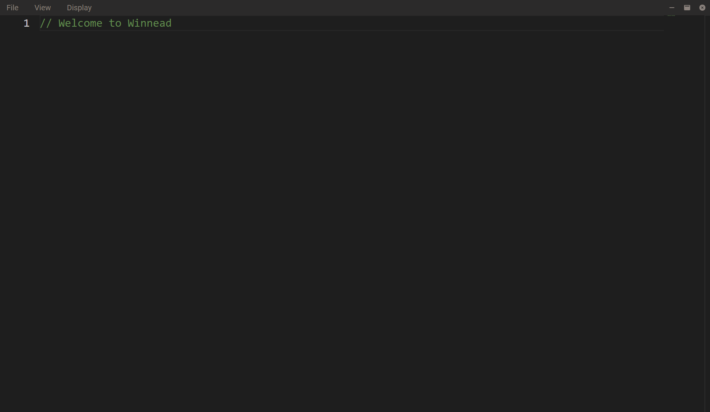

> Winnead is a Native Test Editor made with [Tauri](https://tauri.app/), [React](https://react.dev/) and [Monaco Editor](https://github.com/microsoft/monaco-editor).

## Screenshots

> New File


> README


> Config

## Quick Start
``` console
npm run tauri dev
```

## Dependencies
- npm
- cargo
- tauri